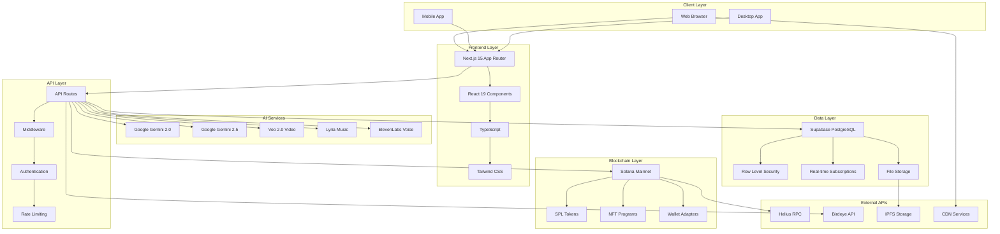
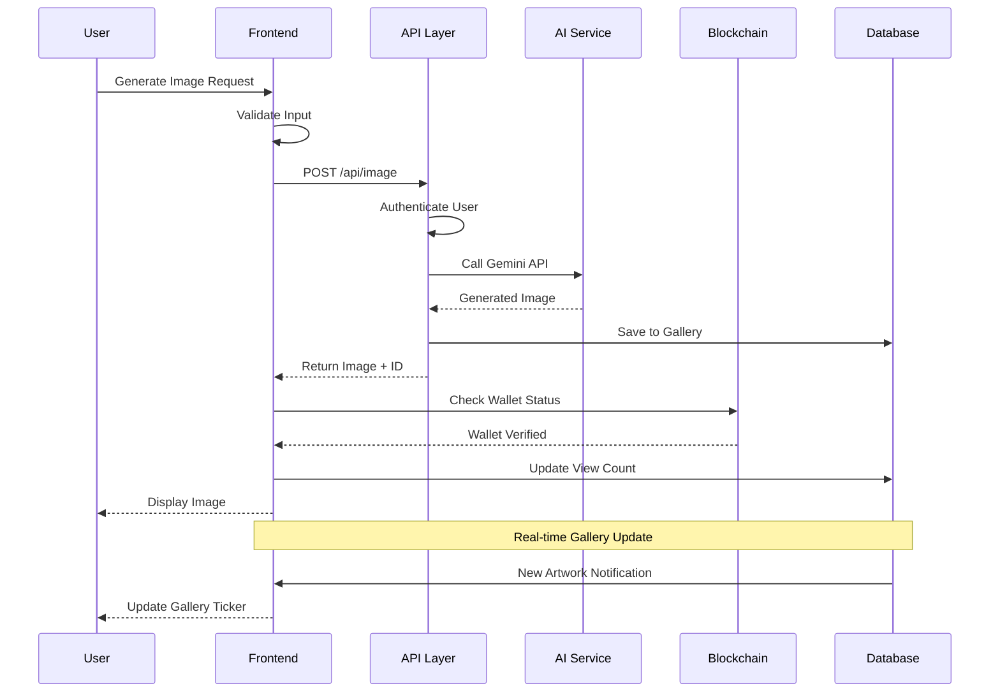
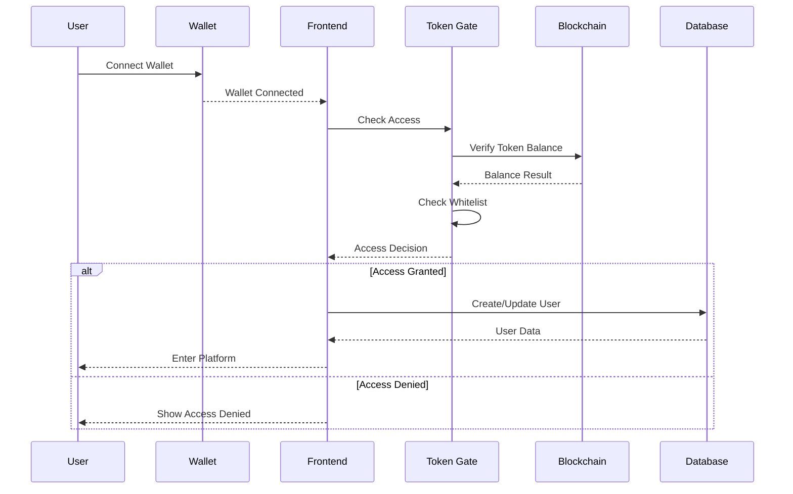

# 🏗️ Gorbagana AI Platform Architecture

> **Technical Deep Dive into the Gorbagana AI Ecosystem**

This document provides a comprehensive technical overview of the Gorbagana AI platform architecture, system design, and implementation details.

## 📊 System Overview



## 🎯 Core Architecture Principles

### 1. **Modular Design**
- **Component-Based**: Reusable React components with clear interfaces
- **API-First**: Well-defined API contracts between layers
- **Microservice Ready**: Easy to extract features into separate services

### 2. **Security by Design**
- **Token-Gated Access**: Blockchain-based authentication
- **Input Validation**: Comprehensive sanitization and validation
- **Rate Limiting**: Protection against abuse and DOS attacks

### 3. **Performance Optimized**
- **Server-Side Rendering**: Fast initial page loads
- **Code Splitting**: Lazy loading of heavy components
- **Caching Strategies**: Multi-layer caching for optimal performance

### 4. **Real-time Capabilities**
- **WebSocket Integration**: Live features and updates
- **Streaming APIs**: Real-time AI generation feedback
- **Event-Driven Updates**: Reactive user interface

## 🔧 Technology Stack Deep Dive

### Frontend Architecture

```typescript
// Component Hierarchy
App Layout
├── Theme Providers
├── Solana Provider Wrapper (Client-side)
│   └── Token Gate
│       ├── Trending Tokens Ticker
│       ├── Realtime Art Gallery
│       ├── Google Search Widget
│       ├── Video Stream Component
│       ├── Main Content Area
│       │   └── Enhanced Gorbagana Terminal
│       ├── DJ Booth Launcher
│       ├── Computer Launcher
│       └── Voice Widget Manager
└── Toast System
```

#### **State Management Pattern**

```typescript
// Custom Hooks for State Management
interface AppState {
  user: UserState;
  chat: ChatState;
  gallery: GalleryState;
  audio: AudioState;
  wallet: WalletState;
}

// Hook-based state management
const useAuth = () => {
  const [user, setUser] = useState<User | null>(null);
  const [isAuthenticated, setIsAuthenticated] = useState(false);
  // ... authentication logic
};

// Context Providers
<AuthProvider>
  <WalletProvider>
    <ThemeProvider>
      <App />
    </ThemeProvider>
  </WalletProvider>
</AuthProvider>
```

### Backend Architecture

```typescript
// API Route Structure
api/
├── art-gallery/         # Community art management
├── audio/              # Text-to-speech generation
├── chat-enhanced/      # Advanced AI conversations
├── document-analyze/   # PDF processing
├── document-process/   # Document upload/analysis
├── image/             # AI image generation
├── mint-nft/          # NFT creation and minting
├── music/             # Music generation
├── trending-tokens/   # Market data aggregation
└── video/             # Video generation
```

#### **API Design Pattern**

```typescript
// Standardized API Response Format
interface APIResponse<T> {
  success: boolean;
  data?: T;
  error?: {
    code: string;
    message: string;
    details?: any;
  };
  metadata?: {
    timestamp: string;
    requestId: string;
    performance: {
      executionTime: number;
      tokensUsed?: number;
    };
  };
}

// Request/Response Flow
export default async function handler(
  req: NextApiRequest,
  res: NextApiResponse<APIResponse<any>>
) {
  try {
    // 1. Validate request
    const validation = validateRequest(req);
    if (!validation.isValid) {
      return res.status(400).json({
        success: false,
        error: { code: 'VALIDATION_ERROR', message: validation.error }
      });
    }

    // 2. Process request
    const result = await processRequest(req.body);

    // 3. Return response
    res.status(200).json({
      success: true,
      data: result,
      metadata: {
        timestamp: new Date().toISOString(),
        requestId: generateRequestId(),
        performance: { executionTime: Date.now() - startTime }
      }
    });
  } catch (error) {
    // Error handling
    res.status(500).json({
      success: false,
      error: { code: 'INTERNAL_ERROR', message: error.message }
    });
  }
}
```

## 🧠 AI Integration Architecture

### Google Gemini Integration

```typescript
// AI Service Layer
class GeminiService {
  private client: GoogleGenerativeAI;
  
  constructor() {
    this.client = new GoogleGenerativeAI(process.env.GOOGLE_GENERATIVE_AI_API_KEY!);
  }

  // Image generation with conversation history
  async generateImage(prompt: string, history?: ChatMessage[], image?: string) {
    const model = this.client.getGenerativeModel({ 
      model: "gemini-2.0-flash-exp-image-generation" 
    });
    
    // Build conversation context
    const context = this.buildContext(history);
    const fullPrompt = `${context}\n\nUser: ${prompt}`;
    
    const result = await model.generateContent({
      contents: [{ role: 'user', parts: [{ text: fullPrompt }] }]
    });
    
    return this.processImageResponse(result);
  }

  // Enhanced chat with thinking capabilities
  async enhancedChat(
    message: string, 
    options: {
      enableThinking?: boolean;
      includeImage?: string;
      history?: ChatMessage[];
    }
  ) {
    const modelName = options.enableThinking 
      ? "gemini-2.5-pro" 
      : "gemini-2.0-flash-exp";
      
    const model = this.client.getGenerativeModel({ 
      model: modelName,
      generationConfig: {
        temperature: 0.7,
        topP: 0.9,
        maxOutputTokens: 8192,
      }
    });

    // Process multimodal input
    const parts = [{ text: message }];
    if (options.includeImage) {
      parts.push({
        inlineData: {
          mimeType: "image/jpeg",
          data: options.includeImage
        }
      });
    }

    const result = await model.generateContent({ contents: [{ role: 'user', parts }] });
    return this.processTextResponse(result);
  }
}
```

### Video Generation (Veo 2.0)

```typescript
// Video generation service
class VideoService {
  async generateVideo(params: VideoGenerationParams) {
    const {
      prompt,
      aspectRatio = "16:9",
      durationSeconds = 5,
      personGeneration = "DONT_ALLOW"
    } = params;

    const model = this.client.getGenerativeModel({ model: "veo-2" });
    
    const request = {
      contents: [{
        role: 'user',
        parts: [{
          text: `Generate a ${durationSeconds}-second video: ${prompt}`,
          videoGenerationConfig: {
            aspectRatio,
            durationSeconds,
            personGeneration
          }
        }]
      }]
    };

    const result = await model.generateContent(request);
    return this.processVideoResponse(result);
  }
}
```

### Music Generation (Lyria)

```typescript
// Real-time music generation
class MusicService {
  private websocket: WebSocket | null = null;

  async generateMusic(config: MusicConfig): Promise<AudioBuffer> {
    const model = this.client.getGenerativeModel({ model: "lyria-realtime" });
    
    const musicPrompt = this.buildMusicPrompt(config);
    const result = await model.generateContent({
      contents: [{ role: 'user', parts: [{ text: musicPrompt }] }]
    });

    return this.processAudioResponse(result);
  }

  // Real-time streaming for live performance
  async startLiveGeneration(config: MusicConfig) {
    this.websocket = new WebSocket(LYRIA_WEBSOCKET_URL);
    
    this.websocket.onopen = () => {
      this.websocket?.send(JSON.stringify({
        type: 'start_generation',
        config: config
      }));
    };

    this.websocket.onmessage = (event) => {
      const audioChunk = this.processAudioChunk(event.data);
      this.playAudioChunk(audioChunk);
    };
  }
}
```

## ⛓️ Blockchain Architecture

### Solana Integration

```typescript
// Wallet and token verification system
class SolanaService {
  private connection: Connection;
  
  constructor() {
    this.connection = new Connection(
      process.env.NEXT_PUBLIC_HELIUS_RPC_URL!,
      'confirmed'
    );
  }

  // Token gating verification
  async verifyAccess(walletAddress: string): Promise<AccessResult> {
    // 1. Check whitelist
    const isWhitelisted = this.checkWhitelist(walletAddress);
    
    // 2. Check GOR token balance
    const gorBalance = await this.getGORBalance(walletAddress);
    
    // 3. Determine access
    const hasAccess = isWhitelisted || (gorBalance >= MIN_GOR_BALANCE);
    
    return {
      hasAccess,
      isWhitelisted,
      gorBalance,
      reason: this.getAccessReason(isWhitelisted, gorBalance)
    };
  }

  // NFT minting
  async mintNFT(params: NFTMintParams): Promise<string> {
    const { metadata, paymentMethod, creatorWallet } = params;
    
    // 1. Upload metadata to IPFS
    const metadataUri = await this.uploadMetadata(metadata);
    
    // 2. Create mint account
    const mintKeypair = Keypair.generate();
    
    // 3. Build transaction
    const transaction = new Transaction();
    
    // Add instructions for minting
    transaction.add(
      SystemProgram.createAccount({
        fromPubkey: creatorWallet.publicKey,
        newAccountPubkey: mintKeypair.publicKey,
        lamports: await this.connection.getMinimumBalanceForRentExemption(MINT_SIZE),
        space: MINT_SIZE,
        programId: TOKEN_PROGRAM_ID,
      }),
      
      createInitializeMintInstruction(
        mintKeypair.publicKey,
        0, // 0 decimals for NFT
        creatorWallet.publicKey,
        creatorWallet.publicKey
      )
    );
    
    // 4. Send transaction
    const signature = await sendAndConfirmTransaction(
      this.connection,
      transaction,
      [creatorWallet, mintKeypair]
    );
    
    return signature;
  }
}
```

### Token Operations

```typescript
// SPL Token management
class TokenService {
  // Burn tokens (Trash Compactor)
  async burnTokens(params: BurnParams): Promise<string> {
    const { tokenMint, amount, ownerWallet } = params;
    
    const tokenAccount = await getAssociatedTokenAddress(
      new PublicKey(tokenMint),
      ownerWallet.publicKey
    );
    
    const transaction = new Transaction().add(
      createBurnInstruction(
        tokenAccount,
        new PublicKey(tokenMint),
        ownerWallet.publicKey,
        amount * Math.pow(10, 9) // Convert to lamports
      )
    );
    
    const signature = await sendAndConfirmTransaction(
      this.connection,
      transaction,
      [ownerWallet]
    );
    
    return signature;
  }

  // Real-time balance checking
  async getTokenBalance(walletAddress: string, tokenMint: string): Promise<number> {
    try {
      const tokenAccounts = await this.connection.getParsedTokenAccountsByOwner(
        new PublicKey(walletAddress),
        { mint: new PublicKey(tokenMint) }
      );
      
      if (tokenAccounts.value.length === 0) return 0;
      
      const balance = tokenAccounts.value[0].account.data.parsed.info.tokenAmount.uiAmount;
      return balance || 0;
    } catch (error) {
      console.error('Error fetching token balance:', error);
      return 0;
    }
  }
}
```

## 💾 Database Architecture

### Supabase Schema Design

```sql
-- Users table with wallet-based authentication
CREATE TABLE users (
  id UUID PRIMARY KEY DEFAULT gen_random_uuid(),
  wallet_address TEXT UNIQUE NOT NULL,
  username TEXT,
  avatar_url TEXT,
  created_at TIMESTAMPTZ DEFAULT NOW(),
  updated_at TIMESTAMPTZ DEFAULT NOW()
);

-- Chat messages with multimodal support
CREATE TABLE chat_messages (
  id UUID PRIMARY KEY DEFAULT gen_random_uuid(),
  user_id UUID REFERENCES users(id) ON DELETE CASCADE,
  content TEXT NOT NULL,
  role TEXT NOT NULL CHECK (role IN ('user', 'assistant')),
  message_type TEXT DEFAULT 'text' CHECK (message_type IN ('text', 'image', 'audio', 'video')),
  metadata JSONB DEFAULT '{}',
  created_at TIMESTAMPTZ DEFAULT NOW()
);

-- Art gallery with community features
CREATE TABLE art_gallery (
  id UUID PRIMARY KEY DEFAULT gen_random_uuid(),
  user_id UUID REFERENCES users(id) ON DELETE CASCADE,
  image_url TEXT NOT NULL,
  prompt TEXT,
  description TEXT,
  likes INTEGER DEFAULT 0,
  dislikes INTEGER DEFAULT 0,
  views INTEGER DEFAULT 0,
  is_public BOOLEAN DEFAULT true,
  is_live BOOLEAN DEFAULT false,
  tags TEXT[] DEFAULT '{}',
  created_at TIMESTAMPTZ DEFAULT NOW(),
  updated_at TIMESTAMPTZ DEFAULT NOW()
);

-- Vote tracking for community engagement
CREATE TABLE art_votes (
  id UUID PRIMARY KEY DEFAULT gen_random_uuid(),
  artwork_id UUID REFERENCES art_gallery(id) ON DELETE CASCADE,
  user_id UUID REFERENCES users(id) ON DELETE CASCADE,
  vote_type TEXT NOT NULL CHECK (vote_type IN ('like', 'dislike')),
  created_at TIMESTAMPTZ DEFAULT NOW(),
  UNIQUE(artwork_id, user_id)
);

-- NFT records for minted artworks
CREATE TABLE nft_records (
  id UUID PRIMARY KEY DEFAULT gen_random_uuid(),
  user_id UUID REFERENCES users(id) ON DELETE CASCADE,
  artwork_id UUID REFERENCES art_gallery(id) ON DELETE SET NULL,
  mint_address TEXT UNIQUE NOT NULL,
  metadata_uri TEXT NOT NULL,
  transaction_signature TEXT NOT NULL,
  royalty_percentage DECIMAL(5,2) DEFAULT 0.00,
  payment_method TEXT CHECK (payment_method IN ('SOL', 'GOR')),
  payment_amount DECIMAL(20,9),
  created_at TIMESTAMPTZ DEFAULT NOW()
);

-- Row Level Security policies
ALTER TABLE users ENABLE ROW LEVEL SECURITY;
ALTER TABLE chat_messages ENABLE ROW LEVEL SECURITY;
ALTER TABLE art_gallery ENABLE ROW LEVEL SECURITY;
ALTER TABLE art_votes ENABLE ROW LEVEL SECURITY;
ALTER TABLE nft_records ENABLE ROW LEVEL SECURITY;

-- Users can only see their own data
CREATE POLICY "Users can view own data" ON users FOR SELECT USING (wallet_address = current_user);
CREATE POLICY "Users can update own data" ON users FOR UPDATE USING (wallet_address = current_user);

-- Chat messages are private to the user
CREATE POLICY "Users can view own messages" ON chat_messages FOR SELECT 
  USING (user_id IN (SELECT id FROM users WHERE wallet_address = current_user));

-- Art gallery has public and private visibility
CREATE POLICY "Public art is visible to all" ON art_gallery FOR SELECT USING (is_public = true);
CREATE POLICY "Users can view own private art" ON art_gallery FOR SELECT 
  USING (user_id IN (SELECT id FROM users WHERE wallet_address = current_user));

-- Voting is public but tracked per user
CREATE POLICY "Anyone can view votes" ON art_votes FOR SELECT USING (true);
CREATE POLICY "Users can vote once per artwork" ON art_votes FOR INSERT 
  WITH CHECK (user_id IN (SELECT id FROM users WHERE wallet_address = current_user));
```

### Real-time Subscriptions

```typescript
// Real-time gallery updates
class RealtimeService {
  private supabase: SupabaseClient;
  
  constructor() {
    this.supabase = createClient(
      process.env.NEXT_PUBLIC_SUPABASE_URL!,
      process.env.NEXT_PUBLIC_SUPABASE_ANON_KEY!
    );
  }

  // Subscribe to new artworks
  subscribeToGallery(callback: (artwork: ArtworkItem) => void) {
    return this.supabase
      .channel('art-gallery')
      .on('postgres_changes', 
        { 
          event: 'INSERT', 
          schema: 'public', 
          table: 'art_gallery',
          filter: 'is_public=eq.true'
        }, 
        (payload) => {
          callback(payload.new as ArtworkItem);
        }
      )
      .subscribe();
  }

  // Subscribe to vote updates
  subscribeToVotes(artworkId: string, callback: (votes: VoteData) => void) {
    return this.supabase
      .channel(`votes-${artworkId}`)
      .on('postgres_changes',
        {
          event: '*',
          schema: 'public',
          table: 'art_votes',
          filter: `artwork_id=eq.${artworkId}`
        },
        () => {
          this.getVoteCounts(artworkId).then(callback);
        }
      )
      .subscribe();
  }
}
```

## 🔄 Data Flow Architecture

### Request/Response Flow



### Authentication Flow



## 🚀 Performance Architecture

### Caching Strategy

```typescript
// Multi-layer caching implementation
class CacheService {
  private memoryCache = new Map<string, CacheItem>();
  private readonly TTL = {
    AI_RESPONSES: 5 * 60 * 1000,     // 5 minutes
    GALLERY_DATA: 30 * 1000,         // 30 seconds
    TOKEN_BALANCES: 60 * 1000,       // 1 minute
    STATIC_DATA: 24 * 60 * 60 * 1000 // 24 hours
  };

  // Memory cache for frequently accessed data
  async get<T>(key: string, fallback: () => Promise<T>, ttl: number): Promise<T> {
    const cached = this.memoryCache.get(key);
    
    if (cached && Date.now() < cached.expiry) {
      return cached.data as T;
    }

    const data = await fallback();
    this.memoryCache.set(key, {
      data,
      expiry: Date.now() + ttl
    });

    return data;
  }

  // Gallery data with real-time invalidation
  async getGalleryData(): Promise<ArtworkItem[]> {
    return this.get(
      'gallery-data',
      () => this.fetchFromDatabase(),
      this.TTL.GALLERY_DATA
    );
  }

  // Token balance caching with automatic refresh
  async getTokenBalance(walletAddress: string): Promise<number> {
    return this.get(
      `balance-${walletAddress}`,
      () => this.fetchTokenBalance(walletAddress),
      this.TTL.TOKEN_BALANCES
    );
  }
}
```

### Code Splitting Strategy

```typescript
// Dynamic imports for heavy components
const DynamicComponents = {
  // AI Generation Components
  ImageGeneration: dynamic(() => import('./ImageGeneration'), {
    loading: () => <LoadingSpinner />,
    ssr: false
  }),
  
  VideoGeneration: dynamic(() => import('./VideoGeneration'), {
    loading: () => <LoadingSpinner />,
    ssr: false
  }),
  
  MusicGeneration: dynamic(() => import('./MusicGeneration'), {
    loading: () => <LoadingSpinner />,
    ssr: false
  }),

  // Blockchain Components
  NFTStudio: dynamic(() => import('./NFTStudio'), {
    loading: () => <LoadingSpinner />,
    ssr: false
  }),

  // Advanced Features
  DJBooth: dynamic(() => import('./DJBoothAdvanced'), {
    loading: () => <LoadingSpinner />,
    ssr: false
  })
};

// Route-based code splitting
const routes = {
  '/': lazy(() => import('./pages/HomePage')),
  '/gallery': lazy(() => import('./pages/GalleryPage')),
  '/studio': lazy(() => import('./pages/StudioPage')),
  '/profile': lazy(() => import('./pages/ProfilePage'))
};
```

## 🔐 Security Architecture

### Input Validation

```typescript
// Comprehensive input validation
class ValidationService {
  // Prompt validation for AI services
  validatePrompt(prompt: string): ValidationResult {
    const rules = [
      { check: prompt.length > 0, error: 'Prompt cannot be empty' },
      { check: prompt.length <= 2000, error: 'Prompt too long (max 2000 chars)' },
      { check: !this.containsRestrictedContent(prompt), error: 'Prompt contains restricted content' },
      { check: this.isValidUTF8(prompt), error: 'Invalid character encoding' }
    ];

    for (const rule of rules) {
      if (!rule.check) {
        return { isValid: false, error: rule.error };
      }
    }

    return { isValid: true };
  }

  // Image upload validation
  validateImageUpload(file: File): ValidationResult {
    const maxSize = 10 * 1024 * 1024; // 10MB
    const allowedTypes = ['image/jpeg', 'image/png', 'image/webp'];

    if (file.size > maxSize) {
      return { isValid: false, error: 'File too large (max 10MB)' };
    }

    if (!allowedTypes.includes(file.type)) {
      return { isValid: false, error: 'Invalid file type' };
    }

    return { isValid: true };
  }

  // Wallet address validation
  validateWalletAddress(address: string): ValidationResult {
    try {
      new PublicKey(address);
      return { isValid: true };
    } catch {
      return { isValid: false, error: 'Invalid Solana wallet address' };
    }
  }
}
```

### Rate Limiting

```typescript
// API rate limiting implementation
class RateLimiter {
  private requests = new Map<string, RequestLog[]>();
  
  private limits = {
    IMAGE_GENERATION: { requests: 10, window: 60 * 1000 },      // 10 per minute
    VIDEO_GENERATION: { requests: 3, window: 60 * 1000 },       // 3 per minute
    MUSIC_GENERATION: { requests: 20, window: 60 * 1000 },      // 20 per minute
    CHAT_REQUESTS: { requests: 100, window: 60 * 1000 },        // 100 per minute
    NFT_MINTING: { requests: 5, window: 60 * 1000 }             // 5 per minute
  };

  async checkLimit(identifier: string, type: keyof typeof this.limits): Promise<boolean> {
    const limit = this.limits[type];
    const now = Date.now();
    const windowStart = now - limit.window;

    // Get existing requests for this identifier
    const userRequests = this.requests.get(identifier) || [];
    
    // Filter to only requests within the current window
    const recentRequests = userRequests.filter(req => req.timestamp > windowStart);
    
    // Check if limit exceeded
    if (recentRequests.length >= limit.requests) {
      return false;
    }

    // Add this request
    recentRequests.push({ timestamp: now, type });
    this.requests.set(identifier, recentRequests);

    return true;
  }
}
```

## 📱 Mobile Architecture

### Responsive Design Strategy

```typescript
// Mobile-first responsive hooks
const useResponsive = () => {
  const [windowSize, setWindowSize] = useState({
    width: 0,
    height: 0
  });

  useEffect(() => {
    const handleResize = () => {
      setWindowSize({
        width: window.innerWidth,
        height: window.innerHeight
      });
    };

    window.addEventListener('resize', handleResize);
    handleResize();

    return () => window.removeEventListener('resize', handleResize);
  }, []);

  return {
    isMobile: windowSize.width < 768,
    isTablet: windowSize.width >= 768 && windowSize.width < 1024,
    isDesktop: windowSize.width >= 1024,
    windowSize
  };
};

// Touch gesture support
const useTouchGestures = (ref: RefObject<HTMLElement>) => {
  const [gesture, setGesture] = useState<GestureState | null>(null);

  useEffect(() => {
    const element = ref.current;
    if (!element) return;

    let startX = 0;
    let startY = 0;

    const handleTouchStart = (e: TouchEvent) => {
      startX = e.touches[0].clientX;
      startY = e.touches[0].clientY;
    };

    const handleTouchEnd = (e: TouchEvent) => {
      const endX = e.changedTouches[0].clientX;
      const endY = e.changedTouches[0].clientY;
      const deltaX = endX - startX;
      const deltaY = endY - startY;

      // Determine gesture type
      if (Math.abs(deltaX) > Math.abs(deltaY)) {
        if (Math.abs(deltaX) > 50) {
          setGesture({ type: deltaX > 0 ? 'swipe-right' : 'swipe-left', deltaX, deltaY });
        }
      } else {
        if (Math.abs(deltaY) > 50) {
          setGesture({ type: deltaY > 0 ? 'swipe-down' : 'swipe-up', deltaX, deltaY });
        }
      }
    };

    element.addEventListener('touchstart', handleTouchStart);
    element.addEventListener('touchend', handleTouchEnd);

    return () => {
      element.removeEventListener('touchstart', handleTouchStart);
      element.removeEventListener('touchend', handleTouchEnd);
    };
  }, [ref]);

  return gesture;
};
```

## 🔮 Future Architecture Considerations

### Scalability Roadmap

```typescript
// Microservices migration path
interface MicroserviceArchitecture {
  services: {
    'ai-generation': {
      responsibilities: ['image', 'video', 'music', 'text'];
      apis: ['/generate', '/process', '/enhance'];
    };
    'blockchain': {
      responsibilities: ['wallet', 'tokens', 'nfts', 'verification'];
      apis: ['/verify', '/mint', '/transfer', '/burn'];
    };
    'community': {
      responsibilities: ['gallery', 'voting', 'social', 'moderation'];
      apis: ['/gallery', '/vote', '/moderate', '/social'];
    };
    'user-management': {
      responsibilities: ['auth', 'profiles', 'preferences', 'sessions'];
      apis: ['/auth', '/profile', '/settings', '/sessions'];
    };
  };
}

// Event-driven architecture
interface EventBus {
  events: {
    'artwork.created': ArtworkCreatedEvent;
    'user.registered': UserRegisteredEvent;
    'nft.minted': NFTMintedEvent;
    'vote.cast': VoteCastEvent;
  };
  
  publishers: string[];
  subscribers: string[];
  
  publish<T>(event: string, data: T): Promise<void>;
  subscribe<T>(event: string, handler: (data: T) => Promise<void>): void;
}
```

### Performance Monitoring

```typescript
// Comprehensive monitoring system
class MonitoringService {
  // Performance metrics
  trackAPIPerformance(endpoint: string, duration: number, success: boolean) {
    this.metrics.push({
      type: 'api_performance',
      endpoint,
      duration,
      success,
      timestamp: Date.now()
    });
  }

  // AI generation metrics
  trackAIGeneration(type: 'image' | 'video' | 'music', tokens: number, duration: number) {
    this.metrics.push({
      type: 'ai_generation',
      generationType: type,
      tokensUsed: tokens,
      duration,
      timestamp: Date.now()
    });
  }

  // User engagement metrics
  trackUserEngagement(action: string, userId: string, metadata?: any) {
    this.metrics.push({
      type: 'user_engagement',
      action,
      userId,
      metadata,
      timestamp: Date.now()
    });
  }

  // Error tracking
  trackError(error: Error, context: string, userId?: string) {
    this.errors.push({
      message: error.message,
      stack: error.stack,
      context,
      userId,
      timestamp: Date.now()
    });
  }
}
```

This architecture document provides a comprehensive technical overview of the Gorbagana AI platform, from high-level system design to implementation details. The modular, secure, and scalable architecture ensures robust performance while maintaining flexibility for future enhancements.

---

**Built for Scale, Designed for Innovation** 🚀