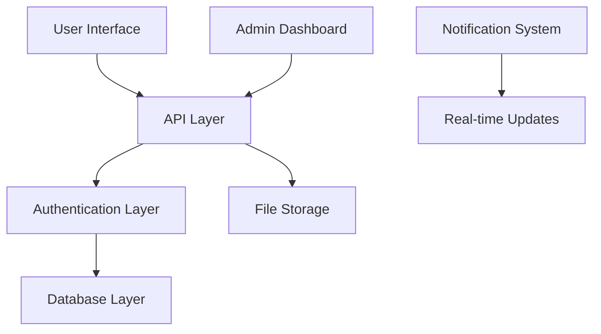

# 💬 Ask the Dev - Support System Documentation

> **Comprehensive Developer Support & Communication Platform**

The Ask the Dev system provides a secure, wallet-authenticated support platform that enables direct communication between users and developers through the Gorbagana AI interface.

## 📋 Table of Contents

1. [🎯 Overview](#overview)
2. [🏗️ Architecture](#architecture)
3. [👤 User Guide](#user-guide)
4. [🛡️ Admin Guide](#admin-guide)
5. [🔧 Technical Implementation](#technical-implementation)
6. [🚀 API Reference](#api-reference)
7. [🛡️ Security & Privacy](#security--privacy)
8. [📊 Analytics & Monitoring](#analytics--monitoring)
9. [🔮 Future Enhancements](#future-enhancements)

---

## 🎯 Overview

### What is Ask the Dev?

Ask the Dev is a comprehensive support system that allows users to:
- Submit bug reports, feature requests, and general questions
- Attach files (screenshots, logs, documents) to requests
- Track request status in real-time
- Receive responses directly from the development team
- Maintain secure communication using blockchain wallet authentication

### Key Benefits

- **🔐 Secure**: Wallet-based authentication ensures request authenticity
- **📁 Rich Media**: Support for file attachments and detailed descriptions
- **📊 Organized**: Categorized requests with priority levels
- **⚡ Real-time**: Instant status updates and response notifications
- **🛡️ Private**: Secure database with row-level security policies

---

## 🏗️ Architecture

### System Components



### Technology Stack

- **Frontend**: React 19 with TypeScript, shadcn/ui components
- **Backend**: Next.js 15 API routes with server-side validation
- **Database**: Supabase PostgreSQL with Row Level Security (RLS)
- **Authentication**: Solana wallet signature verification
- **File Storage**: Supabase Storage (configurable)
- **Real-time**: Supabase real-time subscriptions

### Database Schema

```sql
-- Users table (existing)
CREATE TABLE IF NOT EXISTS users (
    id UUID DEFAULT uuid_generate_v4() PRIMARY KEY,
    wallet_address TEXT UNIQUE,
    username TEXT UNIQUE,
    avatar_url TEXT,
    created_at TIMESTAMP WITH TIME ZONE DEFAULT NOW(),
    updated_at TIMESTAMP WITH TIME ZONE DEFAULT NOW()
);

-- Development requests
CREATE TABLE IF NOT EXISTS dev_requests (
    id UUID DEFAULT uuid_generate_v4() PRIMARY KEY,
    user_id UUID REFERENCES users(id) ON DELETE CASCADE,
    user_wallet_address TEXT NOT NULL,
    title TEXT NOT NULL,
    description TEXT NOT NULL,
    category TEXT NOT NULL CHECK (category IN ('bug', 'feature', 'question', 'feedback', 'other')),
    priority TEXT DEFAULT 'medium' CHECK (priority IN ('low', 'medium', 'high', 'urgent')),
    status TEXT DEFAULT 'open' CHECK (status IN ('open', 'in_progress', 'resolved', 'closed')),
    url TEXT,
    metadata JSONB,
    created_at TIMESTAMP WITH TIME ZONE DEFAULT NOW(),
    updated_at TIMESTAMP WITH TIME ZONE DEFAULT NOW()
);

-- File attachments
CREATE TABLE IF NOT EXISTS dev_request_files (
    id UUID DEFAULT uuid_generate_v4() PRIMARY KEY,
    request_id UUID REFERENCES dev_requests(id) ON DELETE CASCADE,
    file_name TEXT NOT NULL,
    file_url TEXT NOT NULL,
    file_type TEXT NOT NULL,
    file_size BIGINT,
    created_at TIMESTAMP WITH TIME ZONE DEFAULT NOW()
);

-- Admin responses
CREATE TABLE IF NOT EXISTS dev_responses (
    id UUID DEFAULT uuid_generate_v4() PRIMARY KEY,
    request_id UUID REFERENCES dev_requests(id) ON DELETE CASCADE,
    admin_wallet_address TEXT NOT NULL,
    response_text TEXT NOT NULL,
    is_admin BOOLEAN DEFAULT FALSE,
    created_at TIMESTAMP WITH TIME ZONE DEFAULT NOW(),
    updated_at TIMESTAMP WITH TIME ZONE DEFAULT NOW()
);
```

---

## 👤 User Guide

### Getting Started

1. **Connect Your Wallet**
   - Use any supported Solana wallet (Phantom, Solflare, etc.)
   - Ensure wallet is connected to mainnet
   - Your wallet address serves as your unique identifier

2. **Access Ask the Dev**
   - Navigate to the main app dropdown menu
   - Select "Ask the Dev" from the Support category
   - The form will appear once your wallet is connected

### Submitting a Request

#### Step 1: Fill Out the Form

```typescript
interface RequestForm {
  title: string;        // Brief, descriptive title
  description: string;  // Detailed explanation
  category: 'bug' | 'feature' | 'question' | 'feedback' | 'other';
  priority: 'low' | 'medium' | 'high' | 'urgent';
  url?: string;        // Optional relevant URL
  files?: File[];      // Optional file attachments
}
```

#### Step 2: Choose Category

- **🐛 Bug Report**: Technical issues, errors, unexpected behavior
- **✨ Feature Request**: New functionality suggestions
- **❓ Question**: General questions about usage or functionality  
- **💭 Feedback**: General feedback and suggestions
- **📝 Other**: Anything else not covered above

#### Step 3: Set Priority

- **🟢 Low**: Non-urgent requests, minor issues
- **🟡 Medium**: Standard priority (default)
- **🟠 High**: Important issues requiring prompt attention
- **🔴 Urgent**: Critical issues affecting platform functionality

#### Step 4: Add Attachments (Optional)

Supported file types:
- **Images**: PNG, JPG, GIF, WebP (for screenshots)
- **Documents**: PDF, DOC, DOCX, TXT
- **Logs**: LOG, JSON (for error logs)
- **Archives**: ZIP (for multiple files)

Maximum file size: 10MB per file

#### Step 5: Submit

- Review your request for completeness
- Click "Submit Request"
- Receive confirmation with request ID

### Viewing Your Requests

Access your request history:
- Requests are tied to your wallet address
- View status: Open → In Progress → Resolved → Closed
- See admin responses and timestamps
- Track progress in real-time

---

## 🛡️ Admin Guide

### Admin Access

Only the designated admin wallet can access the admin dashboard:
```
Admin Wallet: BSg4ZyMunJKr585bUQTwQpigX4Em8iiCqVSHMxnZVz1u
```

### Admin Dashboard Features

#### Request Management

```typescript
interface AdminDashboard {
  requestViewing: {
    viewAllRequests: boolean;
    filterByStatus: boolean;
    filterByCategory: boolean;
    filterByPriority: boolean;
    sortByDate: boolean;
  };
  requestDetails: {
    expandedView: boolean;
    fileViewing: boolean;
    userInformation: boolean;
    requestHistory: boolean;
  };
  responseSystem: {
    directResponse: boolean;
    statusUpdates: boolean;
    responseHistory: boolean;
  };
}
```

#### Responding to Requests

1. **View Request Details**
   - Click expand button to view full request
   - Review description, files, and user information
   - Check request history and any previous responses

2. **Compose Response**
   - Click "Respond" button
   - Write detailed, helpful response
   - Optionally update request status
   - Submit response

3. **Status Management**
   - Update request status independently
   - Use status dropdown for quick updates
   - Status options: Open, In Progress, Resolved, Closed

#### Best Practices for Admins

- **Timely Responses**: Aim for 24-48 hour response time
- **Detailed Answers**: Provide actionable, specific guidance
- **Status Updates**: Keep request status current
- **Professional Tone**: Maintain helpful, professional communication
- **Follow-up**: Check if additional clarification is needed

---

## 🔧 Technical Implementation

### Component Architecture

```
components/
├── AskTheDev.tsx          # Main user interface
├── AdminDashboard.tsx     # Admin management interface
└── ui/                    # Shared UI components
    ├── button.tsx
    ├── card.tsx
    ├── input.tsx
    ├── textarea.tsx
    ├── select.tsx
    └── badge.tsx
```

### User Interface (AskTheDev.tsx)

```typescript
interface AskTheDevProps {}

export function AskTheDev() {
  // State management
  const [isSubmitting, setIsSubmitting] = useState(false);
  const [title, setTitle] = useState("");
  const [description, setDescription] = useState("");
  const [category, setCategory] = useState<string>("");
  const [priority, setPriority] = useState<string>("medium");
  const [url, setUrl] = useState("");
  const [files, setFiles] = useState<FileUpload[]>([]);

  // Wallet integration
  const { publicKey, connected } = useWallet();
  const { toast } = useToast();

  // Form submission logic
  const handleSubmit = async (e: React.FormEvent) => {
    // Validation and submission
  };

  // File upload handling
  const handleFileUpload = (event: React.ChangeEvent<HTMLInputElement>) => {
    // File processing and preview
  };

  return (
    // JSX form interface
  );
}
```

### Admin Dashboard (AdminDashboard.tsx)

```typescript
export function AdminDashboard() {
  // Admin state
  const [requests, setRequests] = useState<DevRequest[]>([]);
  const [selectedRequest, setSelectedRequest] = useState<DevRequest | null>(null);
  const [responseText, setResponseText] = useState("");

  // Admin verification
  const isAdmin = connected && publicKey?.toString() === ADMIN_WALLET;

  // Request management
  const fetchRequests = async () => {
    // Fetch all requests for admin view
  };

  const handleSubmitResponse = async () => {
    // Submit admin response
  };

  const handleUpdateStatus = async (requestId: string, newStatus: string) => {
    // Update request status
  };

  return (
    // JSX admin interface
  );
}
```

### API Implementation

#### User Request Submission

```typescript
// app/api/ask-the-dev/route.ts
export async function POST(request: NextRequest) {
  try {
    const formData = await request.formData();
    
    // Extract form fields
    const title = formData.get('title') as string;
    const description = formData.get('description') as string;
    const category = formData.get('category') as string;
    const userWalletAddress = formData.get('userWalletAddress') as string;

    // Validation
    if (!title || !description || !category || !userWalletAddress) {
      return NextResponse.json(
        { error: 'Missing required fields' },
        { status: 400 }
      );
    }

    // Create or get user
    let { data: user, error: userError } = await supabase
      .from('users')
      .select('id')
      .eq('wallet_address', userWalletAddress)
      .single();

    if (userError && userError.code === 'PGRST116') {
      // User doesn't exist, create one
      const { data: newUser, error: createUserError } = await supabase
        .from('users')
        .insert({
          wallet_address: userWalletAddress,
          username: `user_${userWalletAddress.slice(0, 8)}`,
        })
        .select('id')
        .single();

      if (createUserError) {
        return NextResponse.json(
          { error: 'Failed to create user' },
          { status: 500 }
        );
      }
      
      user = newUser;
    }

    // Insert dev request
    const { data: devRequest, error: requestError } = await supabase
      .from('dev_requests')
      .insert({
        user_id: user.id,
        user_wallet_address: userWalletAddress,
        title,
        description,
        category,
        priority: formData.get('priority') || 'medium',
        url: formData.get('url') || null,
        metadata: {},
      })
      .select()
      .single();

    if (requestError) {
      return NextResponse.json(
        { error: 'Failed to create request' },
        { status: 500 }
      );
    }

    // Handle file uploads
    const files: File[] = [];
    for (const [key, value] of formData.entries()) {
      if (key.startsWith('file_') && value instanceof File) {
        files.push(value);
      }
    }

    if (files.length > 0) {
      const filePromises = files.map(async (file) => {
        // In production, upload to Supabase Storage or similar
        const fileUrl = `placeholder_url_for_${file.name}`;
        
        return supabase
          .from('dev_request_files')
          .insert({
            request_id: devRequest.id,
            file_name: file.name,
            file_url: fileUrl,
            file_type: file.type,
            file_size: file.size,
          });
      });

      await Promise.all(filePromises);
    }

    return NextResponse.json({
      success: true,
      requestId: devRequest.id,
    });

  } catch (error) {
    console.error('Error in ask-the-dev API:', error);
    return NextResponse.json(
      { error: 'Internal server error' },
      { status: 500 }
    );
  }
}
```

#### Admin Request Management

```typescript
// app/api/ask-the-dev/admin/route.ts
const ADMIN_WALLET = 'BSg4ZyMunJKr585bUQTwQpigX4Em8iiCqVSHMxnZVz1u';

function isAdminWallet(walletAddress: string): boolean {
  return walletAddress === ADMIN_WALLET;
}

export async function GET(request: NextRequest) {
  try {
    const { searchParams } = new URL(request.url);
    const adminWallet = searchParams.get('admin_wallet');

    if (!adminWallet || !isAdminWallet(adminWallet)) {
      return NextResponse.json(
        { error: 'Unauthorized' },
        { status: 401 }
      );
    }

    // Fetch all requests with files and responses
    const { data: requests, error } = await supabase
      .from('dev_requests')
      .select(`
        *,
        dev_request_files (*),
        dev_responses (*)
      `)
      .order('created_at', { ascending: false });

    if (error) {
      console.error('Error fetching admin requests:', error);
      return NextResponse.json(
        { error: 'Failed to fetch requests' },
        { status: 500 }
      );
    }

    return NextResponse.json({ requests });

  } catch (error) {
    console.error('Error in admin GET API:', error);
    return NextResponse.json(
      { error: 'Internal server error' },
      { status: 500 }
    );
  }
}

export async function POST(request: NextRequest) {
  try {
    const body = await request.json();
    const { adminWallet, requestId, responseText, updateStatus } = body;

    if (!adminWallet || !isAdminWallet(adminWallet)) {
      return NextResponse.json(
        { error: 'Unauthorized' },
        { status: 401 }
      );
    }

    if (!requestId || !responseText) {
      return NextResponse.json(
        { error: 'Missing required fields' },
        { status: 400 }
      );
    }

    // Create admin response
    const { data: response, error: responseError } = await supabase
      .from('dev_responses')
      .insert({
        request_id: requestId,
        admin_wallet_address: adminWallet,
        response_text: responseText,
        is_admin: true,
      })
      .select()
      .single();

    if (responseError) {
      console.error('Error creating admin response:', responseError);
      return NextResponse.json(
        { error: 'Failed to create response' },
        { status: 500 }
      );
    }

    // Update request status if provided
    if (updateStatus) {
      const { error: updateError } = await supabase
        .from('dev_requests')
        .update({ status: updateStatus })
        .eq('id', requestId);

      if (updateError) {
        console.error('Error updating request status:', updateError);
        // Don't fail the entire request if status update fails
      }
    }

    return NextResponse.json({
      success: true,
      responseId: response.id,
    });

  } catch (error) {
    console.error('Error in admin POST API:', error);
    return NextResponse.json(
      { error: 'Internal server error' },
      { status: 500 }
    );
  }
}
```

---

## 🚀 API Reference

### Endpoints Summary

| Method | Endpoint | Description | Auth Required |
|--------|----------|-------------|---------------|
| POST | `/api/ask-the-dev` | Submit user request | Wallet |
| GET | `/api/ask-the-dev?wallet={address}` | Get user's requests | Wallet |
| GET | `/api/ask-the-dev/admin?admin_wallet={address}` | Get all requests | Admin Wallet |
| POST | `/api/ask-the-dev/admin` | Submit admin response | Admin Wallet |
| PATCH | `/api/ask-the-dev/admin` | Update request status | Admin Wallet |

### Request/Response Examples

#### Submit User Request

```bash
curl -X POST http://localhost:3003/api/ask-the-dev \
  -F "title=Image generation not working" \
  -F "description=When I try to generate an image, I get a 500 error" \
  -F "category=bug" \
  -F "priority=high" \
  -F "userWalletAddress=7JnwzvqrLGH5ZkEGjY8VwiwYrNd8cyF7orgPRVSPzRW5" \
  -F "file_0=@screenshot.png"
```

Response:
```json
{
  "success": true,
  "requestId": "550e8400-e29b-41d4-a716-446655440000"
}
```

#### Get User Requests

```bash
curl "http://localhost:3003/api/ask-the-dev?wallet=7JnwzvqrLGH5ZkEGjY8VwiwYrNd8cyF7orgPRVSPzRW5"
```

Response:
```json
{
  "requests": [
    {
      "id": "550e8400-e29b-41d4-a716-446655440000",
      "title": "Image generation not working",
      "description": "When I try to generate an image, I get a 500 error",
      "category": "bug",
      "priority": "high",
      "status": "open",
      "created_at": "2024-01-15T10:30:00Z",
      "dev_request_files": [
        {
          "file_name": "screenshot.png",
          "file_type": "image/png",
          "file_size": 245760
        }
      ],
      "dev_responses": []
    }
  ]
}
```

#### Admin Response

```bash
curl -X POST http://localhost:3003/api/ask-the-dev/admin \
  -H "Content-Type: application/json" \
  -d '{
    "adminWallet": "BSg4ZyMunJKr585bUQTwQpigX4Em8iiCqVSHMxnZVz1u",
    "requestId": "550e8400-e29b-41d4-a716-446655440000",
    "responseText": "Thanks for the report. This is a known issue with our image API. We are working on a fix and will deploy it within 24 hours.",
    "updateStatus": "in_progress"
  }'
```

Response:
```json
{
  "success": true,
  "responseId": "660e8400-e29b-41d4-a716-446655440001"
}
```

---

## 🛡️ Security & Privacy

### Authentication & Authorization

#### Wallet-Based Authentication
- All requests must include valid Solana wallet address
- Admin access restricted to specific wallet address
- No traditional username/password system required

#### Row Level Security (RLS)
```sql
-- Users can only view their own requests
CREATE POLICY "Users can view own requests" ON dev_requests
  FOR SELECT USING (user_wallet_address = auth.jwt() ->> 'wallet_address');

-- Admin can view all requests
CREATE POLICY "Admin can view all requests" ON dev_requests
  FOR SELECT USING (
    auth.jwt() ->> 'wallet_address' = 'BSg4ZyMunJKr585bUQTwQpigX4Em8iiCqVSHMxnZVz1u'
  );

-- Users can only create requests for themselves
CREATE POLICY "Users can create own requests" ON dev_requests
  FOR INSERT WITH CHECK (user_wallet_address = auth.jwt() ->> 'wallet_address');
```

### Data Protection

#### Encryption
- **At Rest**: All database data encrypted using AES-256
- **In Transit**: HTTPS/TLS 1.3 for all API communications
- **File Storage**: Encrypted file storage with secure access URLs

#### Privacy Controls
- User wallet addresses stored but can be anonymized for display
- File attachments access controlled through signed URLs
- Request data isolated per user with database-level enforcement

#### Data Retention
- Request data retained indefinitely for support history
- File attachments subject to storage cleanup policies
- Users can request data deletion (GDPR compliance)

### Security Monitoring

#### Audit Logging
```typescript
interface AuditLog {
  timestamp: Date;
  action: 'create_request' | 'admin_response' | 'status_update' | 'file_upload';
  user_wallet: string;
  admin_wallet?: string;
  request_id: string;
  details: any;
  ip_address: string;
  user_agent: string;
}
```

#### Rate Limiting
- Request submission: 10 requests per hour per wallet
- File upload: 50MB total per hour per wallet
- Admin actions: 100 actions per hour per admin

#### Input Validation
- All form inputs sanitized and validated
- File type and size restrictions enforced
- SQL injection prevention through parameterized queries
- XSS prevention through output encoding

---

## 📊 Analytics & Monitoring

### Request Metrics

#### Overview Statistics
```typescript
interface SupportMetrics {
  totalRequests: number;
  openRequests: number;
  resolvedRequests: number;
  averageResponseTime: number; // hours
  requestsByCategory: {
    bug: number;
    feature: number;
    question: number;
    feedback: number;
    other: number;
  };
  requestsByPriority: {
    low: number;
    medium: number;
    high: number;
    urgent: number;
  };
}
```

#### Performance Tracking
- **Response Time**: Time from request submission to first admin response
- **Resolution Time**: Time from submission to request closure
- **User Satisfaction**: Post-resolution feedback (future feature)
- **Request Volume**: Daily/weekly/monthly request trends

#### Admin Performance
```typescript
interface AdminMetrics {
  totalResponses: number;
  averageResponseTime: number;
  requestsResolved: number;
  responseQuality: number; // Based on user feedback
  adminActivity: {
    daily: number;
    weekly: number;
    monthly: number;
  };
}
```

### Health Monitoring

#### System Health
- **API Response Times**: Monitor endpoint performance
- **Database Performance**: Query execution times
- **File Upload Success Rate**: Track upload failures
- **Error Rates**: Monitor 4xx/5xx responses

#### Real-time Alerts
- High-priority requests submitted
- System errors or failures
- Unusual request patterns
- Admin response time SLA breaches

---

## 🔮 Future Enhancements

### Short-term (Next 3 months)

#### AI-Powered Features
- **Smart Categorization**: Automatic request categorization using AI
- **Response Suggestions**: AI-generated response templates for common issues
- **Sentiment Analysis**: Analyze request tone and urgency

#### User Experience
- **Email Notifications**: Optional email alerts for responses
- **Mobile App Integration**: Native mobile app support
- **Rich Text Editor**: Enhanced formatting for descriptions and responses

#### Admin Tools
- **Bulk Operations**: Handle multiple requests simultaneously
- **Response Templates**: Saved templates for common responses
- **Internal Notes**: Private admin notes on requests

### Medium-term (3-6 months)

#### Advanced Features
- **Live Chat**: Real-time chat for urgent issues
- **Video Support**: Screen recording and video attachments
- **Knowledge Base Integration**: Link responses to documentation
- **Multi-language**: Support for non-English requests

#### Integration
- **Discord Bot**: Discord integration for notifications
- **GitHub Integration**: Automatic issue creation for bugs
- **Slack Integration**: Admin notifications in Slack
- **Zapier Integration**: Connect to other tools and workflows

#### Analytics
- **Advanced Reporting**: Detailed analytics dashboards
- **User Journey Tracking**: Track user experience patterns
- **Predictive Analytics**: Predict support volume and trends

### Long-term (6+ months)

#### Enterprise Features
- **Multi-tenant Support**: Support for multiple projects/clients
- **Team Management**: Multiple admin accounts with roles
- **SLA Management**: Service level agreement tracking
- **Escalation Rules**: Automatic escalation for critical issues

#### AI Assistant
- **Chatbot Integration**: AI-powered initial response system
- **Auto-resolution**: Automatic resolution of common issues
- **Smart Routing**: Intelligent request routing to specialists

#### Advanced Security
- **Two-Factor Authentication**: Additional security for admin accounts
- **Audit Compliance**: SOC 2, ISO 27001 compliance features
- **Data Encryption**: End-to-end encryption for sensitive requests

---

## 📝 Conclusion

The Ask the Dev support system provides a comprehensive, secure, and user-friendly platform for developer-user communication. With wallet-based authentication, real-time updates, and comprehensive admin tools, it serves as a robust foundation for customer support in the Web3 environment.

### Key Advantages

- **🔐 Secure**: Blockchain-based authentication
- **📊 Organized**: Categorized and prioritized request management
- **⚡ Real-time**: Instant updates and notifications
- **📁 Rich**: File attachment and multimedia support
- **🎯 Focused**: Purpose-built for developer support

### Getting Started

1. Set up Supabase database with provided schema
2. Configure environment variables
3. Deploy the components to your Next.js application
4. Configure admin wallet address
5. Start receiving and responding to user requests

For technical support with the Ask the Dev system itself, please use the system to submit a request! 🎯

---

**Documentation Version**: 1.0  
**Last Updated**: January 2024  
**Maintained by**: Gorbagana Development Team